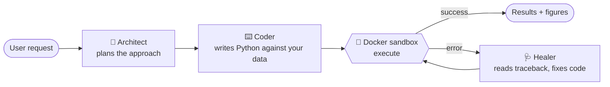
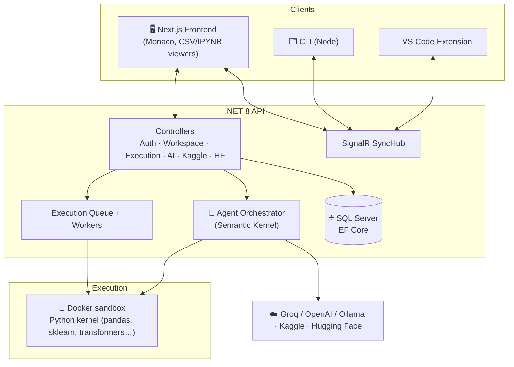

<div align="center">

# 🔭 Currere

### An AI-native, browser-based data-science IDE

Write Python, explore datasets, and let a team of AI agents plan, code, and self-heal your analysis — all from the browser, backed by sandboxed cloud execution.

<br/>


<br/>

**🌐 English** &nbsp;·&nbsp; [🇹🇷 Türkçe](README.tr.md)

</div>

<br/>

<div align="center">
  
</div>

<br/>

> **Project status — work in progress.** Currere is a personal, full-stack learning project. It is not production-hardened and is not intended for deployment. It is published as a portfolio / reference codebase. The user interface is currently in **Turkish**.

---

## Table of Contents

- [What is Currere?](#what-is-currere)
- [Screenshots](#screenshots)
- [Key Features](#key-features)
- [The Multi-Agent AI System](#the-multi-agent-ai-system)
- [Architecture](#architecture)
- [Tech Stack](#tech-stack)
- [Getting Started](#getting-started)
- [Configuration & Secrets](#configuration--secrets)
- [Project Structure](#project-structure)
- [Security Notes](#security-notes)
- [Roadmap](#roadmap)
- [License](#license)

---

## What is Currere?

Currere is a **cloud-style, AI-powered notebook/IDE for data science**. Instead of installing a local Python stack, you create a *workspace*, upload or import a dataset (including directly from **Kaggle**), and write & run Python in a Monaco-powered editor. Code executes inside **isolated, sandboxed containers** on the backend, and results — including Matplotlib figures — stream back to the browser.

What makes it different from a plain online notebook is the **built-in agentic AI layer**. A small team of specialized agents — an **Architect**, a **Coder**, and a **Healer** — can plan an analysis, generate code against your actual data, and automatically diagnose & fix runtime errors. Trained models can then be pushed straight to the **Hugging Face Hub**.

A companion **CLI** and **VS Code extension** connect to a live workspace over real-time SignalR sync, so you can bring your own editor while keeping cloud execution.

---

## Screenshots

<table>
  <tr>
    <td width="50%">
      
      <p align="center"><em>Clean, minimal authentication (JWT + BCrypt)</em></p>
    </td>
    <td width="50%">
      
      <p align="center"><em>Workspace dashboard — manage all your projects</em></p>
    </td>
  </tr>
  <tr>
    <td width="50%">
      
      <p align="center"><em>Create a workspace — Python / Notebook, CPU / GPU runtime</em></p>
    </td>
    <td width="50%">
      
      <p align="center"><em>Global integrations — Kaggle & Hugging Face</em></p>
    </td>
  </tr>
  <tr>
    <td width="50%">
      
      <p align="center"><em>The IDE — Monaco editor, categorized file tree, terminal</em></p>
    </td>
    <td width="50%">
      
      <p align="center"><em>Currere AI — a floating, context-aware coding assistant</em></p>
    </td>
  </tr>
</table>

---

## Key Features

### 🧠 Agentic AI, not just autocomplete
- **Multi-agent pipeline** (Architect → Coder → Healer) built on **Microsoft Semantic Kernel**.
- **Hybrid model routing** — an `Auto (Hybrid)` mode picks between providers; supports **Groq**, **OpenAI**, and **Ollama** connectors.
- **Self-healing execution** — when code fails, the Healer agent reads the traceback and proposes a fix.
- **Context-aware chat** — quote code snippets and reference specific files so the assistant answers against your real project.

### 📊 A real data-science workspace
- **Monaco editor** with Python syntax highlighting and persistent, cache-backed file state.
- **Interactive CSV viewer** (virtualized table via TanStack Virtual) and **Jupyter `.ipynb` viewer**.
- **Inline visual output** — Matplotlib figures are captured and rendered in a dedicated *Visual Output* tab.
- **Synthetic data generation** for quickly bootstrapping datasets.
- **Dataset profiling** to summarize a file's structure and statistics.

### ☁️ Sandboxed cloud execution
- Code runs in **isolated Docker containers** (via `Docker.DotNet`) — never on the host.
- **Execution queue + background workers** (`ExecutionWorker`, `KernelReaperWorker`, `SystemMaintenanceWorker`) manage jobs and reap zombie kernels.
- **Workspace snapshots** — save and restore points of your work.

### 🔌 Integrations
- **Kaggle** — search and download datasets straight into a workspace.
- **Hugging Face** — push trained models/artifacts to the Hub with a write-scoped token.
- **GitHub** (Octokit) — repository operations.

### 🔄 Bring your own editor
- **Real-time sync** over **SignalR** with short-lived, per-workspace sync tokens.
- Official **CLI** (`currere-cli`) and **VS Code extension** connect to a live workspace.

### 🔐 Security-minded backend
- **JWT** authentication with **BCrypt** password hashing.
- **AES encryption service** for integration tokens at rest.
- **Rate limiting**, **FluentValidation** input validation, and **Serilog** structured logging.
- Startup **guard that refuses to boot** if secrets are left at their placeholder values.

---

## The Multi-Agent AI System

Currere models an analysis request as an **execution plan** carried through specialized agents, orchestrated by `AgentOrchestrator` and a `HybridChatCompletionService`:



| Agent | Role |
|-------|------|
| **Architect** | Breaks a high-level goal into a concrete plan of steps. |
| **Coder** | Generates runnable Python tuned to the workspace's files and schema. |
| **Healer** | Inspects failed runs and rewrites the code to recover automatically. |

Each agent has its own prompt + config under `Currere-backend/Agents/Prompts/`, so behavior is tunable without touching code.

---

## Architecture



- **Frontend** talks to the API over REST (`axios`) and to the sync hub over WebSockets (`@microsoft/signalr`).
- **Backend** persists workspaces/users/integrations in **SQL Server via EF Core**, runs AI through **Semantic Kernel**, and dispatches code to **Docker** sandboxes through a queue.
- **Python kernel** (`kernel_repl.py`, `runner.py`) provides a long-lived REPL and a one-shot runner inside the container image defined by `dockerfile`.

---

## Tech Stack

| Layer | Technologies |
|-------|--------------|
| **Frontend** | Next.js 16, React 19, TypeScript 5, Tailwind CSS 4, Zustand, Monaco Editor, SignalR client, Framer Motion, React Markdown |
| **Backend** | .NET 8, ASP.NET Core Web API, Entity Framework Core (SQL Server), SignalR, Serilog, Swashbuckle/Swagger, Hangfire, FluentValidation |
| **AI** | Microsoft Semantic Kernel (OpenAI + Ollama connectors), Groq, custom Architect/Coder/Healer agents |
| **Execution** | Docker (`Docker.DotNet`), sandboxed Python kernel (pandas, scikit-learn, transformers, matplotlib, …) |
| **Auth & Security** | JWT Bearer, BCrypt, AES encryption service, rate limiting |
| **Integrations** | Kaggle, Hugging Face Hub, GitHub (Octokit) |
| **Tooling** | Node CLI, VS Code extension, pytest + xUnit test suites |

---

## Getting Started

### Prerequisites

- [.NET 8 SDK](https://dotnet.microsoft.com/download)
- [Node.js 20+](https://nodejs.org/)
- [SQL Server](https://www.microsoft.com/sql-server) (LocalDB / Express is fine)
- [Docker](https://www.docker.com/) (required for sandboxed code execution)

### 1. Backend

```bash
cd Currere-backend

# Provide secrets via user-secrets (recommended) or environment variables.
# See "Configuration & Secrets" below — the app refuses to start with placeholder values.
dotnet user-secrets init
dotnet user-secrets set "JwtSettings:Secret"      "<a-long-random-64+-char-string>"
dotnet user-secrets set "Encryption:SecretKey"    "<a-long-random-string>"
dotnet user-secrets set "AiSettings:GroqApiKey"   "<your-groq-key>"

# Apply the database schema
dotnet ef database update

# Run the API (Swagger UI at /swagger)
dotnet run
```

### 2. Frontend

```bash
cd currere-frontend
npm install

# Optional: point the app at a non-default backend URL
cp .env.example .env.local     # then edit NEXT_PUBLIC_API_URL if needed

npm run dev                    # http://localhost:3000
```

### 3. CLI (optional)

```bash
cd currere-cli
npm install
# Grab a sync token from the editor (Settings → Sync Token), then:
CURRERE_SYNC_TOKEN=<token> node index.js connect
```

---

## Configuration & Secrets

**No secrets are committed to this repository.** Configuration templates ship with placeholder values; you supply real values locally.

| File | Purpose |
|------|---------|
| `Currere-backend/appsettings.Example.json` | Template for backend config — copy to `appsettings.json` (git-ignored) or, preferably, use **user-secrets**. |
| `currere-frontend/.env.example` | Template for frontend env — copy to `.env.local` (git-ignored). |
| `telemetry.config.example.json` | Template for the optional telemetry config. |

Keys the backend expects (`JwtSettings:Secret`, `Encryption:SecretKey`, `AiSettings:GroqApiKey`, `HuggingFace:ApiKey`, …) can be provided via **`dotnet user-secrets`** or **environment variables**. The app performs a startup check and **throws if any critical secret is missing or left at its placeholder value**, so misconfiguration fails fast instead of running insecurely.

---

## Project Structure

```
Currere/
├── Currere-backend/        # .NET 8 Web API
│   ├── Controllers/        # Auth, Workspace, Execution, AI, Kaggle, HuggingFace, Sync, …
│   ├── Services/           # Business logic, execution queue, workers, encryption
│   ├── Agents/             # Semantic Kernel orchestrator + Architect/Coder/Healer prompts
│   ├── Hubs/               # SignalR SyncHub
│   └── Models/ · DTO's/    # EF Core entities & DTOs
├── currere-frontend/       # Next.js 16 + React 19 app
│   └── src/
│       ├── app/            # login, register, dashboard, editor routes
│       ├── components/     # Monaco editor, CSV/Jupyter viewers, AI panel, terminal
│       ├── hooks/ · store/ # SignalR sync, file cache, Zustand stores
│       └── services/       # axios API client
├── currere-cli/            # Node CLI for real-time sync
├── Currere-extension/      # VS Code extension
├── Currere.Tests/          # xUnit tests (encryption, integrations, sync)
├── kernel_repl.py          # Long-lived Python REPL kernel
├── runner.py               # One-shot code runner
├── dockerfile              # Data-science Python sandbox image
└── docs/images/            # Screenshots used in this README
```

---

## Security Notes

This is a learning project, but it was built with security hygiene in mind:

- ✅ **No real secrets in the repo or its git history** — API-key fields have always held placeholders; only example templates are committed.
- ✅ **Secrets are externalized** to user-secrets / environment variables, with a fail-fast startup guard.
- ✅ **Passwords hashed** with BCrypt; **integration tokens encrypted** at rest (AES).
- ✅ **Sandboxed execution** — user code runs in disposable Docker containers, never on the host.
- ✅ Sensitive files (`appsettings.json`, `.env*`, certificates, user workspaces, telemetry config) are **git-ignored**.

> Currere has **not** undergone a professional security audit and is not intended for public deployment.

---

## Roadmap

Currere is an evolving project. Areas that are partial or planned:

- [ ] Full English localization of the UI (currently Turkish)
- [ ] Broader test coverage across controllers
- [ ] GPU runtime execution path
- [ ] Collaborative multi-user workspaces
- [ ] Hardened, deployment-ready configuration

---

## License

Released under the **MIT License** — see [LICENSE](LICENSE) for the full text.

You are free to use, modify, and distribute this code, including commercially, provided the copyright notice and license are preserved. The software is provided "as is", without warranty of any kind.

<div align="center">
<br/>
Built with ❤️ by <strong>Enes Yel</strong>
</div>
