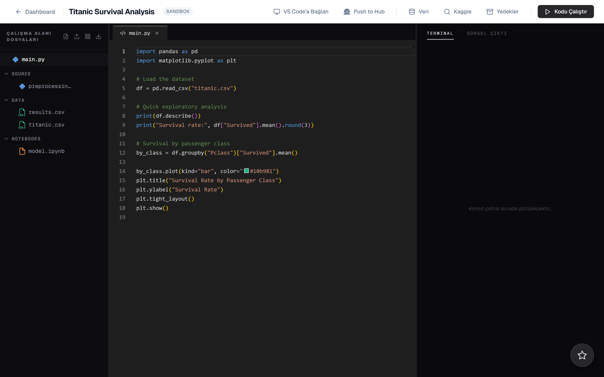
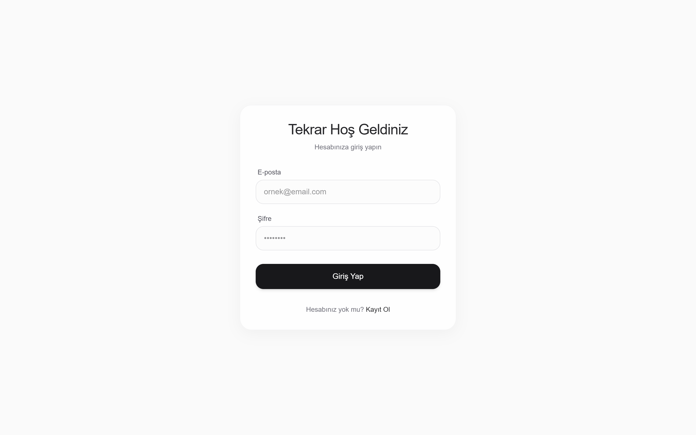
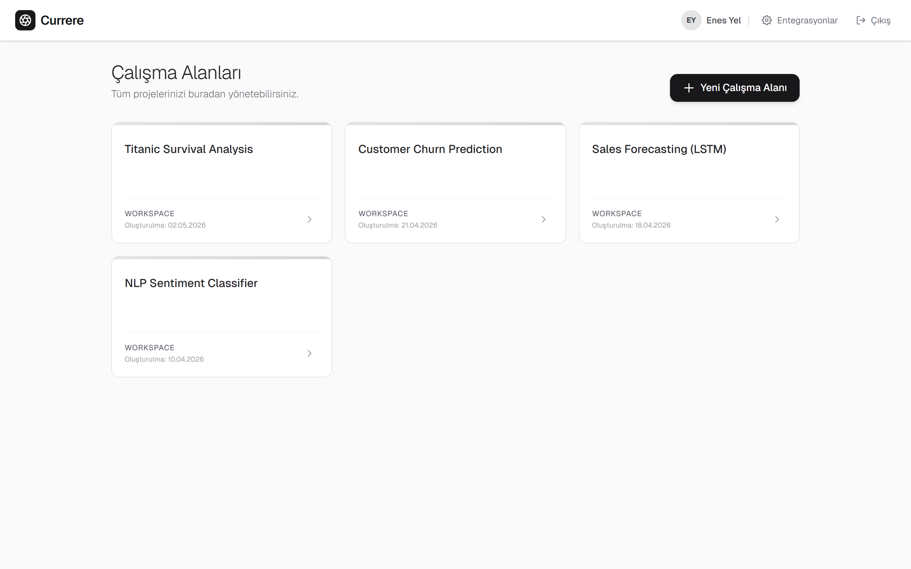
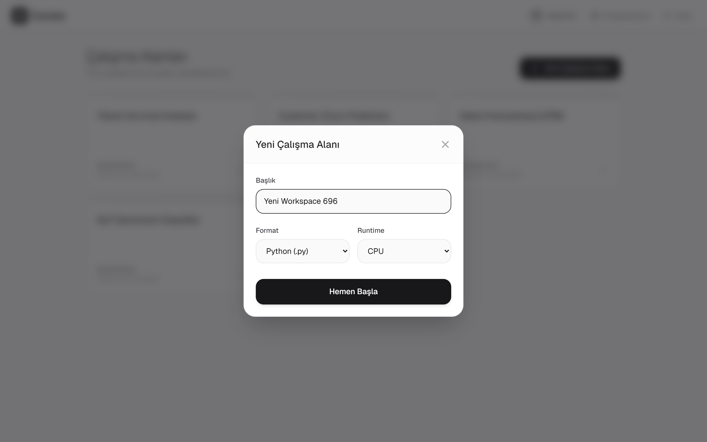
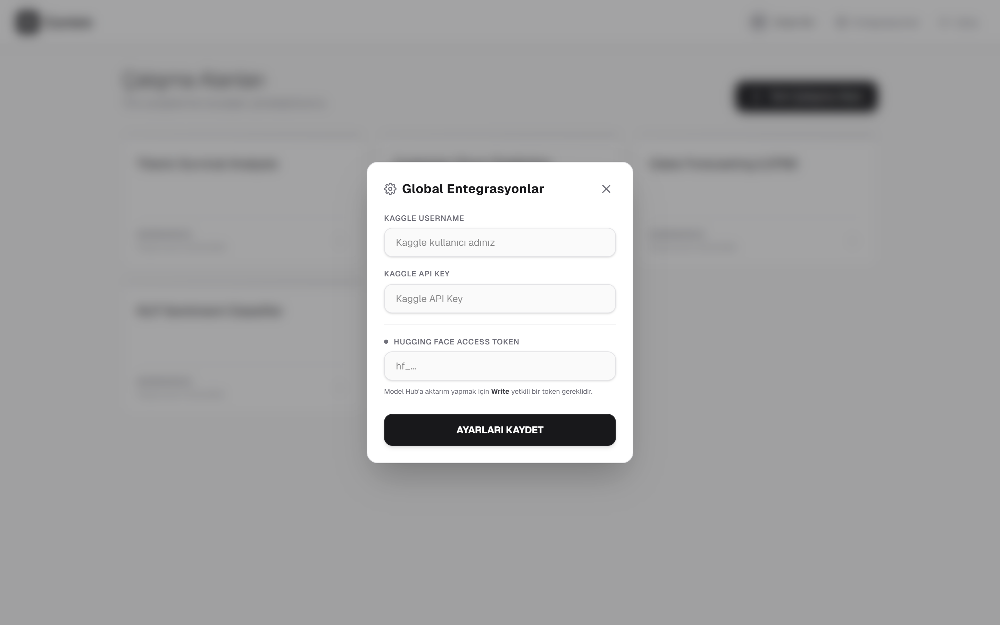
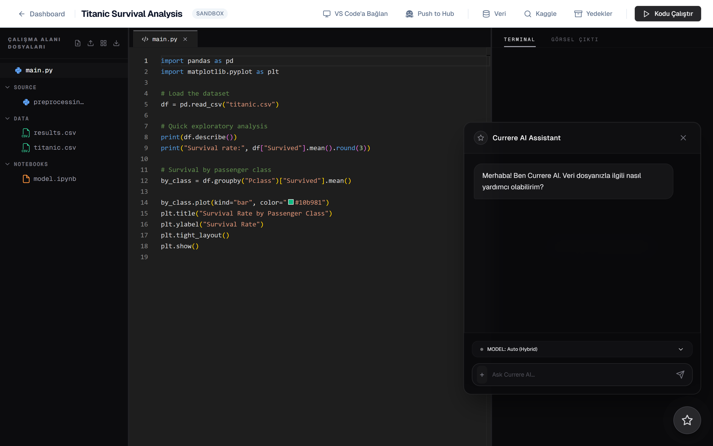
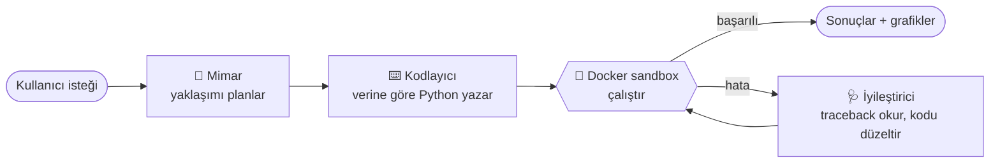
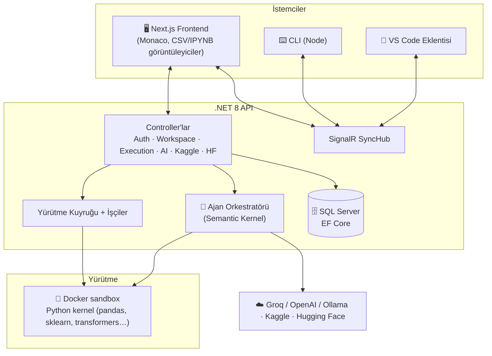

<div align="center">

# 🔭 Currere

### Yapay zekâ odaklı, tarayıcı tabanlı bir veri bilimi IDE'si

Python yaz, veri setlerini keşfet ve analizini planlayıp kodlayan, hatalarını kendi kendine düzelten bir yapay zekâ ajanları ekibinden yararlan — hepsi tarayıcıdan, izole (sandbox) bulut yürütmesiyle.

<br/>


<br/>

[🌐 English](README.md) &nbsp;·&nbsp; **🇹🇷 Türkçe**

</div>

<br/>

<div align="center">
  
</div>

<br/>

> **Proje durumu — geliştirme aşamasında.** Currere, kişisel ve full-stack bir öğrenme projesidir. Production seviyesinde sağlamlaştırılmamıştır ve deploy edilmek için tasarlanmamıştır. Portfolyo / referans kod tabanı olarak yayınlanmıştır. Kullanıcı arayüzü şu anda **Türkçe**'dir.

---

## İçindekiler

- [Currere Nedir?](#currere-nedir)
- [Ekran Görüntüleri](#ekran-görüntüleri)
- [Öne Çıkan Özellikler](#öne-çıkan-özellikler)
- [Çoklu Ajan Yapay Zekâ Sistemi](#çoklu-ajan-yapay-zekâ-sistemi)
- [Mimari](#mimari)
- [Teknoloji Yığını](#teknoloji-yığını)
- [Başlarken](#başlarken)
- [Yapılandırma ve Sırlar](#yapılandırma-ve-sırlar)
- [Proje Yapısı](#proje-yapısı)
- [Güvenlik Notları](#güvenlik-notları)
- [Yol Haritası](#yol-haritası)
- [Lisans](#lisans)

---

## Currere Nedir?

Currere, **bulut tarzı, yapay zekâ destekli bir veri bilimi notebook/IDE'sidir**. Yerel bir Python ortamı kurmak yerine, bir *çalışma alanı* (workspace) oluşturur, bir veri seti yükler veya içe aktarır (doğrudan **Kaggle**'dan dahil), ve Monaco tabanlı bir editörde Python yazıp çalıştırırsın. Kod, backend üzerinde **izole, sandbox konteynerlerde** çalışır; Matplotlib grafikleri dahil sonuçlar tarayıcıya akıtılır.

Onu sıradan bir çevrimiçi notebook'tan ayıran şey, **yerleşik ajansal (agentic) yapay zekâ katmanıdır**. Uzmanlaşmış küçük bir ajan ekibi — bir **Mimar (Architect)**, bir **Kodlayıcı (Coder)** ve bir **İyileştirici (Healer)** — bir analizi planlayabilir, gerçek verine göre kod üretebilir ve çalışma zamanı hatalarını otomatik olarak teşhis edip düzeltebilir. Eğitilen modeller ardından doğrudan **Hugging Face Hub**'a gönderilebilir.

Bir de eşlik eden **CLI** ve **VS Code eklentisi**, gerçek zamanlı SignalR senkronizasyonu üzerinden canlı bir çalışma alanına bağlanır — böylece kendi editörünü kullanırken bulut yürütmesini korursun.

---

## Ekran Görüntüleri

<table>
  <tr>
    <td width="50%">
      
      <p align="center"><em>Sade, minimal kimlik doğrulama (JWT + BCrypt)</em></p>
    </td>
    <td width="50%">
      
      <p align="center"><em>Çalışma alanı panosu — tüm projelerini yönet</em></p>
    </td>
  </tr>
  <tr>
    <td width="50%">
      
      <p align="center"><em>Çalışma alanı oluştur — Python / Notebook, CPU / GPU runtime</em></p>
    </td>
    <td width="50%">
      
      <p align="center"><em>Global entegrasyonlar — Kaggle ve Hugging Face</em></p>
    </td>
  </tr>
  <tr>
    <td width="50%">
      
      <p align="center"><em>IDE — Monaco editör, kategorize dosya ağacı, terminal</em></p>
    </td>
    <td width="50%">
      
      <p align="center"><em>Currere AI — bağlama duyarlı, yüzen bir kodlama asistanı</em></p>
    </td>
  </tr>
</table>

---

## Öne Çıkan Özellikler

### 🧠 Yalnızca otomatik tamamlama değil, ajansal yapay zekâ
- **Microsoft Semantic Kernel** üzerine kurulu **çoklu ajan hattı** (Mimar → Kodlayıcı → İyileştirici).
- **Hibrit model yönlendirme** — bir `Auto (Hybrid)` modu sağlayıcılar arasında seçim yapar; **Groq**, **OpenAI** ve **Ollama** konnektörlerini destekler.
- **Kendi kendini iyileştiren yürütme** — kod başarısız olduğunda İyileştirici ajan traceback'i okuyup bir düzeltme önerir.
- **Bağlama duyarlı sohbet** — kod parçacıklarını alıntıla ve belirli dosyalara referans ver; asistan gerçek projene göre yanıtlasın.

### 📊 Gerçek bir veri bilimi çalışma alanı
- Python söz dizimi vurgulaması ve kalıcı, cache destekli dosya durumuyla **Monaco editör**.
- **Etkileşimli CSV görüntüleyici** (TanStack Virtual ile sanallaştırılmış tablo) ve **Jupyter `.ipynb` görüntüleyici**.
- **Satır içi görsel çıktı** — Matplotlib grafikleri yakalanır ve özel bir *Görsel Çıktı* sekmesinde gösterilir.
- Veri setlerini hızlıca oluşturmak için **sentetik veri üretimi**.
- Bir dosyanın yapısını ve istatistiklerini özetlemek için **veri seti profilleme**.

### ☁️ Sandbox bulut yürütmesi
- Kod, **izole Docker konteynerlerinde** çalışır (`Docker.DotNet` ile) — asla host üzerinde değil.
- **Yürütme kuyruğu + arka plan işçileri** (`ExecutionWorker`, `KernelReaperWorker`, `SystemMaintenanceWorker`) işleri yönetir ve zombi kernelleri temizler.
- **Çalışma alanı anlık görüntüleri (snapshot)** — çalışmanın kayıt/geri yükleme noktaları.

### 🔌 Entegrasyonlar
- **Kaggle** — veri setlerini ara ve doğrudan bir çalışma alanına indir.
- **Hugging Face** — write yetkili bir token ile eğitilmiş modelleri/çıktıları Hub'a gönder.
- **GitHub** (Octokit) — repo işlemleri.

### 🔄 Kendi editörünü getir
- Kısa ömürlü, çalışma alanı başına senkron token'larıyla **SignalR** üzerinden **gerçek zamanlı senkronizasyon**.
- Resmî **CLI** (`currere-cli`) ve **VS Code eklentisi** canlı bir çalışma alanına bağlanır.

### 🔐 Güvenlik odaklı backend
- **BCrypt** parola hash'lemesiyle **JWT** kimlik doğrulaması.
- Entegrasyon token'ları için rest halinde **AES şifreleme servisi**.
- **Rate limiting**, **FluentValidation** girdi doğrulaması ve **Serilog** yapılandırılmış loglama.
- Sırlar placeholder değerlerinde bırakılırsa **başlatmayı reddeden** bir açılış koruması.

---

## Çoklu Ajan Yapay Zekâ Sistemi

Currere, bir analiz isteğini uzmanlaşmış ajanlar boyunca taşınan bir **yürütme planı** olarak modeller; bunu `AgentOrchestrator` ve bir `HybridChatCompletionService` yönetir:



| Ajan | Rol |
|------|-----|
| **Mimar (Architect)** | Üst düzey bir hedefi somut adımlardan oluşan bir plana böler. |
| **Kodlayıcı (Coder)** | Çalışma alanının dosyalarına ve şemasına göre ayarlanmış, çalıştırılabilir Python üretir. |
| **İyileştirici (Healer)** | Başarısız çalıştırmaları inceler ve otomatik toparlanmak için kodu yeniden yazar. |

Her ajanın `Currere-backend/Agents/Prompts/` altında kendi prompt + config dosyası vardır; böylece davranış, koda dokunmadan ayarlanabilir.

---

## Mimari



- **Frontend**, API ile REST üzerinden (`axios`), senkron hub'ıyla WebSocket üzerinden (`@microsoft/signalr`) konuşur.
- **Backend**, çalışma alanlarını/kullanıcıları/entegrasyonları **EF Core ile SQL Server**'da tutar, yapay zekâyı **Semantic Kernel** üzerinden çalıştırır ve kodu bir kuyruk aracılığıyla **Docker** sandbox'larına gönderir.
- **Python kernel** (`kernel_repl.py`, `runner.py`), `dockerfile` ile tanımlanan konteyner imajı içinde uzun ömürlü bir REPL ve tek seferlik bir çalıştırıcı sağlar.

---

## Teknoloji Yığını

| Katman | Teknolojiler |
|--------|--------------|
| **Frontend** | Next.js 16, React 19, TypeScript 5, Tailwind CSS 4, Zustand, Monaco Editor, SignalR client, Framer Motion, React Markdown |
| **Backend** | .NET 8, ASP.NET Core Web API, Entity Framework Core (SQL Server), SignalR, Serilog, Swashbuckle/Swagger, Hangfire, FluentValidation |
| **Yapay Zekâ** | Microsoft Semantic Kernel (OpenAI + Ollama konnektörleri), Groq, özel Mimar/Kodlayıcı/İyileştirici ajanları |
| **Yürütme** | Docker (`Docker.DotNet`), sandbox Python kernel (pandas, scikit-learn, transformers, matplotlib, …) |
| **Kimlik & Güvenlik** | JWT Bearer, BCrypt, AES şifreleme servisi, rate limiting |
| **Entegrasyonlar** | Kaggle, Hugging Face Hub, GitHub (Octokit) |
| **Araçlar** | Node CLI, VS Code eklentisi, pytest + xUnit test paketleri |

---

## Başlarken

### Gereksinimler

- [.NET 8 SDK](https://dotnet.microsoft.com/download)
- [Node.js 20+](https://nodejs.org/)
- [SQL Server](https://www.microsoft.com/sql-server) (LocalDB / Express yeterli)
- [Docker](https://www.docker.com/) (sandbox kod yürütmesi için gerekli)

### 1. Backend

```bash
cd Currere-backend

# Sırları user-secrets (önerilir) veya ortam değişkenleri ile sağla.
# Aşağıdaki "Yapılandırma ve Sırlar" bölümüne bak — placeholder değerlerle uygulama başlamaz.
dotnet user-secrets init
dotnet user-secrets set "JwtSettings:Secret"      "<64+-karakterlik-rastgele-bir-dize>"
dotnet user-secrets set "Encryption:SecretKey"    "<uzun-rastgele-bir-dize>"
dotnet user-secrets set "AiSettings:GroqApiKey"   "<groq-anahtarın>"

# Veritabanı şemasını uygula
dotnet ef database update

# API'yi çalıştır (Swagger arayüzü /swagger adresinde)
dotnet run
```

### 2. Frontend

```bash
cd currere-frontend
npm install

# İsteğe bağlı: uygulamayı varsayılan olmayan bir backend URL'sine yönlendir
cp .env.example .env.local     # ardından gerekirse NEXT_PUBLIC_API_URL'i düzenle

npm run dev                    # http://localhost:3000
```

### 3. CLI (isteğe bağlı)

```bash
cd currere-cli
npm install
# Editörden bir senkron token al (Ayarlar → Sync Token), sonra:
CURRERE_SYNC_TOKEN=<token> node index.js connect
```

---

## Yapılandırma ve Sırlar

**Bu depoya hiçbir sır (secret) commit edilmemiştir.** Yapılandırma şablonları placeholder değerlerle gelir; gerçek değerleri yerel olarak sen sağlarsın.

| Dosya | Amaç |
|-------|------|
| `Currere-backend/appsettings.Example.json` | Backend yapılandırma şablonu — `appsettings.json`'a (git-ignored) kopyala veya tercihen **user-secrets** kullan. |
| `currere-frontend/.env.example` | Frontend env şablonu — `.env.local`'e (git-ignored) kopyala. |
| `telemetry.config.example.json` | İsteğe bağlı telemetri yapılandırması şablonu. |

Backend'in beklediği anahtarlar (`JwtSettings:Secret`, `Encryption:SecretKey`, `AiSettings:GroqApiKey`, `HuggingFace:ApiKey`, …) **`dotnet user-secrets`** veya **ortam değişkenleri** ile sağlanabilir. Uygulama, açılışta bir kontrol yapar ve **kritik bir sır eksikse veya placeholder değerinde bırakılmışsa hata fırlatır**; böylece yanlış yapılandırma güvensiz çalışmak yerine hızlıca başarısız olur.

---

## Proje Yapısı

```
Currere/
├── Currere-backend/        # .NET 8 Web API
│   ├── Controllers/        # Auth, Workspace, Execution, AI, Kaggle, HuggingFace, Sync, …
│   ├── Services/           # İş mantığı, yürütme kuyruğu, işçiler, şifreleme
│   ├── Agents/             # Semantic Kernel orkestratörü + Mimar/Kodlayıcı/İyileştirici prompt'ları
│   ├── Hubs/               # SignalR SyncHub
│   └── Models/ · DTO's/    # EF Core varlıkları & DTO'lar
├── currere-frontend/       # Next.js 16 + React 19 uygulaması
│   └── src/
│       ├── app/            # login, register, dashboard, editor rotaları
│       ├── components/     # Monaco editör, CSV/Jupyter görüntüleyiciler, AI paneli, terminal
│       ├── hooks/ · store/ # SignalR senkron, dosya cache, Zustand store'lar
│       └── services/       # axios API istemcisi
├── currere-cli/            # Gerçek zamanlı senkron için Node CLI
├── Currere-extension/      # VS Code eklentisi
├── Currere.Tests/          # xUnit testleri (şifreleme, entegrasyonlar, senkron)
├── kernel_repl.py          # Uzun ömürlü Python REPL kernel'i
├── runner.py               # Tek seferlik kod çalıştırıcı
├── dockerfile              # Veri bilimi Python sandbox imajı
└── docs/images/            # Bu README'de kullanılan ekran görüntüleri
```

---

## Güvenlik Notları

Bu bir öğrenme projesi olsa da güvenlik hijyeni göz önünde bulundurularak inşa edilmiştir:

- ✅ **Depoda veya git geçmişinde gerçek sır yok** — API anahtarı alanları hep placeholder tutmuştur; yalnızca örnek şablonlar commit edilmiştir.
- ✅ **Sırlar dışsallaştırılmıştır** — user-secrets / ortam değişkenleri ile, hızlı başarısız olan bir açılış koruması eşliğinde.
- ✅ Parolalar BCrypt ile **hash'lenir**; entegrasyon token'ları rest halinde **şifrelenir** (AES).
- ✅ **Sandbox yürütme** — kullanıcı kodu, host'ta değil, tek kullanımlık Docker konteynerlerinde çalışır.
- ✅ Hassas dosyalar (`appsettings.json`, `.env*`, sertifikalar, kullanıcı çalışma alanları, telemetri yapılandırması) **git-ignored**'dır.

> Currere **profesyonel bir güvenlik denetiminden geçmemiştir** ve herkese açık (public) bir deploy için tasarlanmamıştır.

---

## Yol Haritası

Currere, gelişen bir projedir. Kısmi veya planlanan alanlar:

- [ ] Arayüzün tam İngilizce yerelleştirmesi (şu anda Türkçe)
- [ ] Controller'lar genelinde daha geniş test kapsamı
- [ ] GPU runtime yürütme yolu
- [ ] Çok kullanıcılı, iş birlikçi çalışma alanları
- [ ] Sağlamlaştırılmış, deploya hazır yapılandırma

---

## Lisans

**MIT Lisansı** altında yayınlanmıştır — tam metin için [LICENSE](LICENSE) dosyasına bak.

Telif hakkı bildirimi ve lisans korunduğu sürece bu kodu ticari kullanım dahil olmak üzere serbestçe kullanabilir, değiştirebilir ve dağıtabilirsin. Yazılım, herhangi bir garanti olmaksızın "olduğu gibi" sağlanır.

<div align="center">
<br/>
<strong>Enes Yel</strong> tarafından ❤️ ile geliştirildi
</div>
